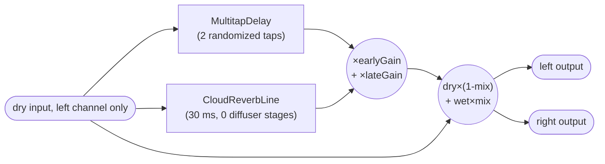
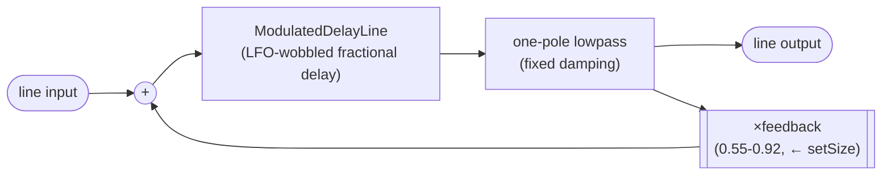

# Galerna DSP Software Architecture

This project keeps the STM32CubeMX generated firmware structure and adds a modern C++
`galerna` layer, organized as a set of small per-namespace libraries.

## Vendor-scaffolded files

Originally generated by STM32CubeMX, now hand-maintained as ordinary firmware source
(the `.ioc` project has been retired — see `docs/cubemx/README.md`):

- `firmware_core/` (MCU bring-up: `main.c`, IRQ table, HAL MSP config -- renamed from the
  original CubeMX `Core/` to avoid colliding with `galerna/core`, the unrelated C++ DSP
  primitives library). Has its own `CMakeLists.txt`: a `firmware_core` `INTERFACE`
  library for `inc/`, and `galerna_configure_cubemx_target()`, which attaches
  `firmware_core/src/*.c` + `firmware_core/startup_stm32f405xx.s` to a given app
  executable target. `firmware_core/STM32F405XX_FLASH.ld` (the linker script) lives here
  too, referenced from `cmake/gcc-arm-none-eabi.cmake`'s `-T` flag.
- `drivers/` (STM32 HAL/CMSIS; only this top-level directory name is ours -- everything
  beneath it keeps ST's original vendor path casing/structure). Has its own
  `CMakeLists.txt`: the `stm32cubemx` `INTERFACE` library (HAL/CMSIS include dirs +
  defines) and the `STM32_Drivers` `STATIC` library (the vendor HAL/LL sources).
- `cmake/gcc-arm-none-eabi.cmake`

## `galerna/` libraries

Each subdirectory of `galerna/` is an independent CMake library with its own
`CMakeLists.txt`, mirroring its C++ namespace 1:1 (`galerna::core`, `galerna::effects`,
...), and its own `include/galerna/<lib>/`, `tests/` (and `src/` for `platform`, the only
one with compiled `.cpp`) layout. Real CMake target names can't contain `::`, so each
library declares a plain target (e.g. `galerna_core`) plus a `galerna::<lib>` `ALIAS`
target (the standard pattern used for namespaced targets, e.g. `Boost::boost`) -- always
link against the alias, never the plain name.

- `galerna/hal/`: HAL concepts (`hal::Gpio`, `hal::Adc`, `hal::I2cBus`, ...) that platform
  drivers are constrained on via C++20 concepts + template dependency injection, not
  virtual interfaces. Also exposes a test-only `galerna::hal::fakes` library
  (`tests/fakes/Fake{Adc,Gpio,I2c}.hpp`) for host-testing anything constrained on these
  concepts.
- `galerna/core/`: platform-independent DSP primitives and other logic genuinely reusable
  across apps (e.g. `BinaryLedDisplay.hpp`).
- `galerna/drivers/`: device drivers using concepts and template dependency injection.
- `galerna/effects/`: DSP effects conforming to the `processBlock(AudioBuffer&)` shape
  `ProcessorChain` expects (e.g. `Bypass`, `Gain`, `ThxDeepNote`, `CloudReverb` — see this doc's
  Reverb section below for `CloudReverb`'s design), plus any supporting types private to one
  effect (e.g. `ThxVoice`, used only by `ThxDeepNote`).
- `galerna/platform/`: STM32-specific adapters over HAL (`galerna/platform/stm32f405/`),
  the only `galerna/` library that's a real (`STATIC`) build target rather than
  `INTERFACE` -- and the only one with no `tests/`, since it's a thin HAL wrapper with no
  logic of its own (see `CLAUDE.md`'s testability rule for `Platform`).

Each library only links the sibling `galerna::*` libraries its headers actually
`#include` (e.g. `galerna::core` links `galerna::hal` because `BinaryLedDisplay.hpp` uses
`hal::Gpio`; `galerna::effects` links `galerna::core` because `ThxDeepNote`/`ThxVoice` use
`StateVariableFilter`/`WavetableOscillator`). `galerna/CMakeLists.txt` just
`add_subdirectory()`s all five in dependency order.

## Reverb: `CloudReverb` (`galerna::effects::CloudReverb`)

Used by `applications/wind_chimes/` (chained after `WindChimes` via `ProcessorChain` — see
`applications/wind_chimes/app.cpp`). A scaled-down homage to
[CloudSeed](https://github.com/ValdemarOrn/CloudSeed)/[CloudReverb](https://github.com/xunil-cloud/CloudReverb)'s
algorithmic-reverb topology (multitap early reflections, plus a late-reverb line with an
LFO-modulated delay and diffuser in its feedback loop) — CloudSeed itself targets a desktop VST
with no CPU/RAM ceiling (up to 50 early taps, 8 diffuser stages, 12 late lines).

**This is CloudReverb's second, much smaller size.** The first attempt (2 independent per-channel
"tanks" for stereo width, 3 parallel late lines each with a 2-stage diffuser, a 3-stage early
diffuser chain — ~98 KB of buffers) was designed and host-tested before real hardware was
available to check its CPU cost. Once flashed, it measured `maxProcessCycles` at **~5.8x the
per-block budget** (even after force-inlining the whole hot path with
`[[gnu::flatten]]`/`[[gnu::always_inline]]`, the same fix `ThxDeepNote`/`WindChimes` already
needed), because `WindChimes` alone was already tuned close to its own budget ceiling on this
24 MHz Cortex-M4 — there was very little spare budget for *any* substantial extra per-sample DSP,
let alone ~24 LFO-modulated delay reads per stereo frame. See the CPU cost section below for the
full measured tuning history. The design below is what actually fits.

### Signal flow

One shared **mono** tank (not two per-channel tanks — that was the single biggest cost cut, since
it roughly halves everything outright). `WindChimes` already writes an identical signal to both
channels, so CloudReverb reads only the left channel as its dry input and mirrors the same wet
signal back to both outputs — the stereo-width trick the first design used
(`channelDelayScaleRight`, a per-channel delay detune) is gone along with the second tank:



Early and late are parallel (both fed the dry input directly, not chained), matching CloudSeed's
own "Dry / Predelay / Early / Main" mixer taps. `CloudReverb::setMix()` is the only control on
the final blend; `CloudReverb::setSize()` drives the late line's feedback gain.

### `CloudReverbLine`

The class itself is general-purpose — a modulated delay, a one-pole damping filter, and a
configurable number of `ModulatedAllpass` diffuser stages in its feedback loop — but the shipped
`wind_chimes` build instantiates it with **0 diffuser stages** (see the CPU cost section for why),
so it degrades to the delay+damping+feedback loop alone:



With diffuser stages configured (as the class supports, just not as currently instantiated here),
`damp` would feed into a chain of `ModulatedAllpass` stages before reaching `output`/`fb` instead
— that chain is the actual "cloudy" ingredient: without it, or without the delay's own LFO wobble
(kept even at 0 diffuser stages), a feedback delay just rings at a fixed pitch, audibly metallic.
`feedback` is clamped below `CloudReverbLine::maxFeedback` (0.92). Reverb *decay time* is governed
by this feedback gain, not by any buffer's length: `RT60 ≈ -6.9·N / (Fs·ln(feedback))` for a delay
of `N` samples, so a short delay line can still sustain an arbitrarily long tail by raising
feedback close to 1 — push it too far past what the delay length can diffuse smoothly, though, and
it reads as a resonant drone instead of a wash, which is a deliberate character choice available
here (via `setSize()`), not a bug.

### Memory

Every buffer is a fixed-size `std::array` (no dynamic allocation, matches this project's
`-fno-exceptions` build). Measured on the real `wind_chimes` STM32 Release build
(`arm-none-eabi-size`) at this final (mono, 1 line, 0 diffuser stages) size: **19,392 B / 128 KB
main SRAM (14.8%)** — down from 111,416 B (85%) for the first, much larger design. Memory was
never actually the binding constraint here (even the first design fit, barely); CPU was. CCM RAM
(a second, CPU-only 64 KB region at `0x1000_0000` — see `firmware_core/STM32F405XX_FLASH.ld`) was
considered as extra headroom during the first design, but `firmware_core/startup_stm32f405xx.s`
has no copy/zero-fill loop wired up for it (only `.data`/`.bss` are handled in `Reset_Handler`) —
using it would mean extending that boot-critical assembly. Moot now given how much headroom the
final size has, but worth knowing about if a future change gets memory-tight again.

One non-obvious pitfall hit while building the first (larger) design, worth remembering for any
future `galerna/effects` class with big buffers: a class that's a pure aggregate of literal types
(floats, `std::array`, no non-`constexpr` constructors anywhere in the tree) is eligible for the
compiler to *constant-initialize* as a global — baking its default state (nearly all zero, but not
quite: things like `WavetableOscillator`'s default amplitude are nonzero) into a real byte image
duplicated in FLASH and copied to RAM on every boot, rather than landing in `.bss`. This showed up
as `.data` ballooning to 103 KB. `WindChimes` never hits this because `WindChimeVoice` embeds
`core::Xorshift32`, whose non-`constexpr` constructor already forces dynamic initialization.
`CloudReverb` has an explicit, deliberately empty, user-provided constructor for the same effect
(see the comment on its constructor) — dynamic initialization instead writes only the actually-
nonzero scalar fields at boot, and the bulk buffers land in `.bss` (zero-filled, no FLASH image).

### CPU cost -- hardware-verified

Budget is one sample period: `SystemCoreClock * audioFramesPerHalf / audioSampleRateHz` ≈
`24,000,000 * 64 / 32,552` ≈ **47,190 cycles per 64-frame block**. Measured via
`applications/wind_chimes/app.cpp`'s SWO diagnostics (`audioEngine.maxProcessCycles()`,
`DuplexAudioBlockProcessor::clipCount()`) across several real-hardware flash-and-measure rounds,
each one a genuine cut (not just a parameter tweak) once the first design's ~5.8x overrun made
clear that incremental tuning wouldn't be enough:

| Step | maxProcessCycles | vs. budget | clipCount |
|---|---|---|---|
| First design (2 tanks, 3 late lines, 3-stage early diffuser), before force-inlining | 305,988 | 6.5x | ~51% of samples |
| Same design, after `[[gnu::flatten]]`/`[[gnu::always_inline]]` on the hot path | 274,715 | 5.8x | ~51% of samples |
| Mono (1 tank), 1 late line, no early diffuser chain, `WindChimes::voiceCount` still 8 | 68,793 | 1.46x | ~100% of samples |
| + late line diffuser 2→1 stage, multitap taps 4→2 | 56,795 | 1.20x | ~100% of samples |
| + `WindChimes::voiceCount` 5→4 | 51,777 | 1.10x | ~50% of samples |
| + `WindChimes::voiceCount` 4→3 | 46,225 | **0.98x (97.9%)** | ~0.08% of samples |
| + late line diffuser 1→0 stages (final) | **39,165** | **0.83x (83.0%)** | **0.04%** |

The 97.9% row technically fit, but this codebase already has a precedent for not trusting a
measurement that tight: `ThxDeepNote::voiceCount`'s own comment describes a 98.8% measurement
being judged "too risky... no margin left for jitter" and backed off from even though it worked in
that one measurement. The same call was made here — one more cut (the late line's last diffuser
stage) for real margin, landing at 83.0% with `errorCount` 0 over a 30s soak, instead of shipping
a razor's edge. `WindChimes::voiceCount` settled at 3 (down from 8 before CloudReverb existed) —
sparser chimes than originally designed, traded for reverb headroom, per project decision.

The `MultitapDelay`/`CloudReverbLine`/`ModulatedAllpass`/`ModulatedDelayLine` classes themselves
are unchanged in shape from the first design — only *how many* of each `CloudReverb` instantiates,
and their template-parameter sizes, changed. Both are trivial to scale back up (more late lines,
more diffuser stages, per-channel tanks again) if a future hardware change (faster clock, a
leaner `WindChimes`) frees up budget — just re-verify with the same measurement loop first.

## Apps

- `applications/<name>/`: one independently-buildable, independently-flashable firmware
  "app" per subdirectory (e.g. `applications/thx_deep_note/`, `applications/pot_blink/`).
  `app.cpp` wires up the concrete hardware objects it needs and provides the
  `App_Init`/`App_Tick` C-ABI entry points `firmware_core/src/main.c` calls -- the same two
  entry points, unchanged, regardless of which app is linked in. An app also owns any
  host-testable `init()`/`tick()` class and supporting types that only make sense for that
  one app and aren't reusable elsewhere (e.g. `ThxDeepNoteApp.hpp`), living right next to
  `app.cpp` instead of under `galerna/`. Add a new app by adding a new
  `applications/<name>/app.cpp` and a `galerna_add_app(<name>)` call in
  `applications/CMakeLists.txt`; see that file's `galerna_add_app()` function.
- `applications/common/`: small pieces shared by every app: `app.h` (the `App_Init`/`App_Tick`
  declarations), `SwoDebug.cpp` (SWO `printf` plumbing), and `BoardControls.h` (the board's
  fixed status LED/button/switch counts and ADC full-scale value, `galerna::app::ledCount` et
  al. -- every per-app `*App.hpp` includes it instead of redeclaring its own copies).

## Build commands

STM32 firmware -- builds every app target (one `.elf`/`.bin`/`.hex` per
`applications/<name>/`, e.g. `thx_deep_note`, `pot_blink`); add `--target <name>` to build
just one:

```bash
cmake --preset Debug
cmake --build --preset Debug

cmake --preset Release
cmake --build --preset Release
```

Host tests:

```bash
cmake --preset host-debug
cmake --build --preset host-debug
ctest --preset host-debug
```
