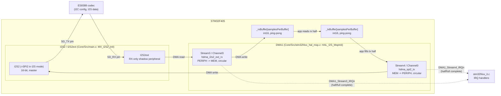
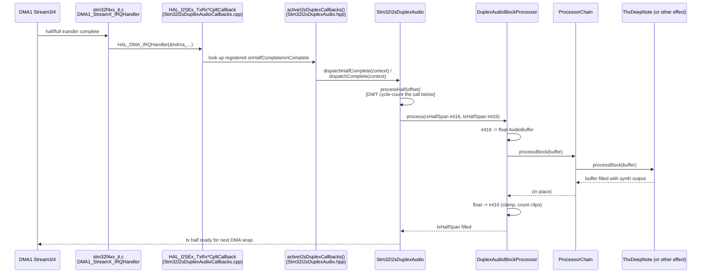

# Audio / DMA Configuration

How full-duplex I2S audio moves between the ES8388 codec and the DSP effect
chain: the DMA hardware wiring, and the interrupt-to-callback path that
connects it to application code. Companion to `docs/architecture.md` (which
covers file/module layout) and `docs/progress.md` (bring-up history) --- this
doc is about the *runtime data path* for one specific subsystem.

## Hardware wiring: two DMA streams for one full-duplex link

The F405's SPI2/I2S2 peripheral is half-duplex-only. Full-duplex I2S is done
by pairing I2S2 (TX) with **I2S2ext**, a receive-only shadow peripheral that
shares I2S2's clock/word-select lines but has its own data register and DMA
request line -- so it needs its own DMA stream. Both streams are driven in
lockstep by `HAL_I2SEx_TransmitReceive_DMA()` and started together in
`Stm32I2sDuplexAudio::start()`.

The stream/channel numbers below are not configurable choices -- they're
fixed by the F405's DMA request-mapping table (RM0090 Table 42): SPI2_TX can
only ever be reached via DMA1 Stream4/Channel0, I2S2ext_RX only via DMA1
Stream3/Channel3.

Both streams run in **circular** DMA mode against the *same* buffer size
(`samplesPerBuffer = FramesPerHalf * 2 (stereo) * 2 (ping-pong halves)`), so
they wrap and re-fire their half/complete interrupts together, one sample
period apart at most. `DMA_PDATAALIGN_HALFWORD`/`DMA_MDATAALIGN_HALFWORD`
match the 16-bit (`I2S_DATAFORMAT_16B`) sample width configured in
`MX_I2S2_Init()`.

## Software path: ISR to DSP effect

Once a half-buffer is fully transferred, the interrupt has to travel from
the vector table down to whichever C++ effect object is currently plugged
into the app -- crossing from C-ABI HAL callbacks into a templated C++
object along the way. Every stage below is generic except the last one
(`ThxDeepNote::processBlock`); swapping the effect type in
`Applications/<Name>/app.cpp` is the only thing that changes what audio
comes out.

Why the indirection exists at each stage:

- **DMA1 IRQ &rarr; `HAL_DMA_IRQHandler`**: `DMA1_Stream3_IRQHandler`/
  `DMA1_Stream4_IRQHandler` (`Core/Src/stm32f4xx_it.c`) do nothing but
  forward into HAL's generic per-stream handler, which inspects status
  registers and decides which I2S-level callback to invoke.
- **HAL callback &rarr; global bridge struct**: `HAL_I2SEx_TxRxHalfCpltCallback`
  /`HAL_I2SEx_TxRxCpltCallback`/`HAL_I2S_ErrorCallback` are HAL's `__weak`
  callback hooks, overridden with strong definitions in
  `Galerna/Platform/Stm32F405/Stm32I2sDuplexAudioCallbacks.cpp` (compiled
  directly into each app executable, not into the `galerna_platform_stm32`
  static archive, so the linker is forced to pull the override in). HAL's
  callback signature is a bare C function taking only `I2S_HandleTypeDef*`,
  with no way to reach a specific C++ object -- so these overrides just read
  a single global `I2sDuplexCallbacks` struct (`activeI2sDuplexCallbacks()`)
  and invoke whatever function pointer + `void* context` is registered
  there. One global slot is enough because exactly one audio engine is ever
  live on real hardware.
- **Bridge &rarr; `Stm32I2sDuplexAudio` instance**: `start()` registers
  `dispatchHalfComplete`/`dispatchComplete`/`dispatchError` static
  trampolines plus `this` as `context` -- these cast `context` back to
  `Stm32I2sDuplexAudio*` and call the real method, which is what actually
  gets a C++ object into the picture.
- **`Stm32I2sDuplexAudio` &rarr; `DuplexAudioBlockProcessor`**: `processHalf()`
  slices out whichever ping-pong half of the raw int16 buffers just became
  safe to touch and calls `_processor.process(rxHalfSpan, txHalfSpan)` --
  `_processor` is whatever the app wired up as the second constructor
  argument (`Applications/ThxDeepNote/app.cpp`: `audioProcessor`).
- **`DuplexAudioBlockProcessor` &rarr; `ProcessorChain` &rarr; effect**: this is
  where hardware int16 samples become the app's DSP domain -- int16 is
  converted to a float `AudioBuffer`, run through `ProcessorChain::processBlock`
  (which just forwards to each `Processors...`, here a single
  `ThxDeepNote`), then converted back to int16 with clamping (tracked via
  `clipCount()`).

## Where to look for each piece

| Concern | File |
| --- | --- |
| DMA stream/channel/priority config | `Core/Src/stm32f4xx_hal_msp.c` (`HAL_I2S_MspInit`), `Core/Src/main.c` (`MX_DMA_Init`) |
| DMA IRQ vector wiring | `Core/Src/stm32f4xx_it.c` |
| HAL callback overrides (ISR &rarr; C++ bridge) | `Galerna/Platform/Stm32F405/Stm32I2sDuplexAudioCallbacks.cpp` |
| Ping-pong buffers, callback registration, cycle budget measurement | `Galerna/Platform/Stm32F405/Stm32I2sDuplexAudio.hpp` |
| int16 &lt;-&gt; float conversion, clipping | `Galerna/Core/DuplexAudioBlockProcessor.hpp` |
| Effect chaining | `Galerna/Core/ProcessorChain.hpp` |
| Concrete effect (per app) | `Galerna/Effects/*.hpp`, wired in `Applications/<Name>/app.cpp` |
