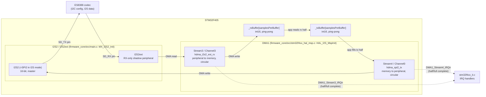
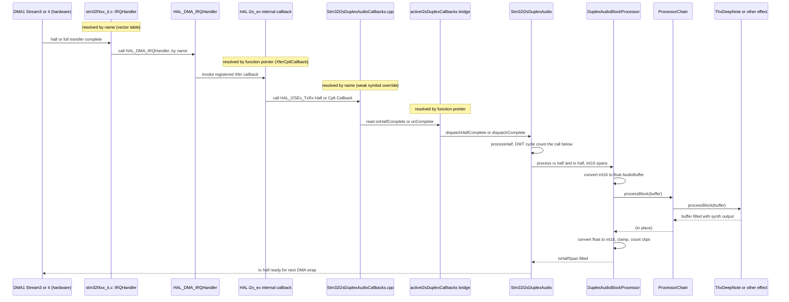

# Audio / DMA Configuration

How full-duplex I2S audio moves between the ES8388 codec and the DSP effect
chain: the DMA hardware wiring, and the interrupt-to-callback path that
connects it to application code. Companion to `docs/architecture.md` (which
covers file/module layout) and `docs/progress.md` (bring-up history) --- this
doc is about the *runtime data path* for one specific subsystem.

## Hardware wiring: two DMA streams for one full-duplex link

The F405's SPI2/I2S2 peripheral is half-duplex-only. Full-duplex I2S is done
by pairing I2S2 (TX) with **I2S2ext**, a receive-only shadow peripheral that
shares I2S2's clock/word-select lines but has its own data register and DMA
request line -- so it needs its own DMA stream. Both streams are driven in
lockstep by `HAL_I2SEx_TransmitReceive_DMA()` and started together in
`Stm32I2sDuplexAudio::start()`.

The stream/channel numbers below are not configurable choices -- they're
fixed by the F405's DMA request-mapping table (RM0090 Table 42): SPI2_TX can
only ever be reached via DMA1 Stream4/Channel0, I2S2ext_RX only via DMA1
Stream3/Channel3.

Both streams run in **circular** DMA mode against the *same* buffer size
(`samplesPerBuffer = FramesPerHalf * 2 (stereo) * 2 (ping-pong halves)`), so
they wrap and re-fire their half/complete interrupts together, one sample
period apart at most. `DMA_PDATAALIGN_HALFWORD`/`DMA_MDATAALIGN_HALFWORD`
match the 16-bit (`I2S_DATAFORMAT_16B`) sample width configured in
`MX_I2S2_Init()`.

## Software path: ISR to DSP effect, step by step

Once a half-buffer is fully transferred, the interrupt has to travel from
the vector table down to whichever C++ effect object is currently plugged
into the app. At each hop below, the "next function" is resolved one of two
ways -- **by name** (a fixed symbol the linker resolves at build time, not
changeable without breaking the link) or **by function pointer** (a value
stored in a struct/variable, assigned at runtime, changeable by writing a
different value into it). Knowing which one applies at each hop is the key
to understanding what you can and can't rename or reconfigure.

1. **Hardware sets an interrupt status flag** on DMA1 Stream3 (RX, line-in)
   or Stream4 (TX, line-out) when its half/full transfer completes.

2. **CPU vectors to the ISR — by name.** `DMA1_Stream3_IRQHandler` /
   `DMA1_Stream4_IRQHandler` (`firmware_core/src/stm32f4xx_it.c`) are fixed names
   the startup file's vector table (`startup_stm32f405xx.s`) points at by
   symbol. Rename these and the vector table entry goes back to its default
   (do-nothing) handler.

3. **ISR calls `HAL_DMA_IRQHandler(&hdma_...)` — ordinary call by name.**
   Each handler passes its own DMA handle (`&hdma_i2s2_ext_rx` or
   `&hdma_spi2_tx`), so `HAL_DMA_IRQHandler` already knows which stream's
   status/clear registers to touch.

4. **`HAL_DMA_IRQHandler` picks a callback — by function pointer.** It reads
   that stream's transfer-complete/half-complete/error flags and calls
   whichever of `hdma->XferHalfCpltCallback` / `XferCpltCallback` /
   `XferErrorCallback` is non-null. These are ordinary function-pointer
   members on the `DMA_HandleTypeDef` struct -- HAL doesn't know or care
   what the pointed-to function is named.

5. **Those pointers were assigned earlier, by `HAL_I2SEx_TransmitReceive_DMA()`.**
   This runs once, inside `Stm32I2sDuplexAudio::start()`, and wires (HAL
   source, `stm32f4xx_hal_i2s_ex.c`):
   - `hdma_i2s2_ext_rx.XferHalfCpltCallback = I2SEx_TxRxDMAHalfCplt`
   - `hdma_i2s2_ext_rx.XferCpltCallback = I2SEx_TxRxDMACplt`
   - `hdma_i2s2_ext_rx.XferErrorCallback = I2SEx_TxRxDMAError`
   - `hdma_spi2_tx.XferHalfCpltCallback = NULL`, `.XferCpltCallback = NULL`
   - `hdma_spi2_tx.XferErrorCallback = I2SEx_TxRxDMAError`

   Only the **RX** handle gets half/complete callbacks -- both DMA streams
   run in lockstep off the same I2S clock, so HAL only needs one side (RX)
   to signal "half/full done"; the TX handle only ever needs its error path
   wired.

6. **HAL's internal function resolves the DMA handle back to the I2S
   handle, then calls the public callback — by name.**
   `I2SEx_TxRxDMAHalfCplt`/`I2SEx_TxRxDMACplt` read `hdma->Parent` (`=
   &hi2s2`, set by the `__HAL_LINKDMA(hi2s, hdmarx, hdma_i2s2_ext_rx)` macro
   in *our* `HAL_I2S_MspInit()`, `firmware_core/src/stm32f4xx_hal_msp.c`) and call
   `HAL_I2SEx_TxRxHalfCpltCallback(hi2s)` / `HAL_I2SEx_TxRxCpltCallback(hi2s)`
   directly by symbol name, not through a pointer.

7. **Linker resolves that name to our override.** HAL declares
   `HAL_I2SEx_TxRxHalfCpltCallback`/`HAL_I2SEx_TxRxCpltCallback`/
   `HAL_I2S_ErrorCallback` `__weak` (a do-nothing default). We define
   *strong* functions with the exact same names in
   `galerna/platform/src/stm32f405/Stm32I2sDuplexAudioCallbacks.cpp` (compiled
   directly into each app executable, not into the `galerna_platform`
   static archive, so the linker is forced to pull the override in). These
   names are **not renameable** -- a different name wouldn't override
   anything, and HAL would silently keep calling its own empty default.

8. **Our override reads a global bridge struct — by function pointer.**
   HAL's callback signature is a bare C function taking only
   `I2S_HandleTypeDef*`, with no way to reach a specific C++ object. So each
   override just reads `activeI2sDuplexCallbacks()` (`Stm32I2sDuplexAudio.hpp`)
   and calls whatever `onHalfComplete`/`onComplete`/`onError` function
   pointer + `void* context` is registered there. One global slot is enough
   because exactly one audio engine is ever live on real hardware.

9. **Bridge calls a static trampoline — by function pointer, registered in
   `Stm32I2sDuplexAudio::start()`.** `dispatchHalfComplete`/`dispatchComplete`
   /`dispatchError` cast `context` back to `Stm32I2sDuplexAudio*` and call
   the real method (`onHalfComplete()`/`onComplete()`) -- this is the hop
   that finally gets a concrete C++ object back into the picture.

10. **`onHalfComplete()`/`onComplete()` &rarr; `processHalf(offset)`** slices out
    whichever ping-pong half of the raw int16 buffers just became safe to
    touch and calls `_processor.process(rxHalfSpan, txHalfSpan)` --
    `_processor` is whatever the app wired up as the second constructor
    argument (`applications/thx_deep_note/app.cpp`: `audioProcessor`), an
    ordinary (compile-time-resolved, template) call from here on.

11. **`DuplexAudioBlockProcessor::process()` &rarr; `ProcessorChain` &rarr; effect.**
    int16 is converted to a float `AudioBuffer`, run through
    `ProcessorChain::processBlock` (forwards to each `Processors...`, here a
    single `ThxDeepNote`), then converted back to int16 with clamping
    (tracked via `clipCount()`). This is the only stage where swapping the
    effect type in `applications/<name>/app.cpp` changes what audio comes
    out -- every hop before it is generic.

## Where to look for each piece

| Concern | File |
| --- | --- |
| DMA stream/channel/priority config | `firmware_core/src/stm32f4xx_hal_msp.c` (`HAL_I2S_MspInit`), `firmware_core/src/main.c` (`MX_DMA_Init`) |
| DMA IRQ vector wiring | `firmware_core/src/stm32f4xx_it.c` |
| HAL callback overrides (ISR &rarr; C++ bridge) | `galerna/platform/src/stm32f405/Stm32I2sDuplexAudioCallbacks.cpp` |
| Ping-pong buffers, callback registration, cycle budget measurement | `galerna/platform/include/galerna/platform/stm32f405/Stm32I2sDuplexAudio.hpp` |
| int16 &lt;-&gt; float conversion, clipping | `galerna/core/include/galerna/core/DuplexAudioBlockProcessor.hpp` |
| Effect chaining | `galerna/core/include/galerna/core/ProcessorChain.hpp` |
| Concrete effect (per app) | `galerna/effects/include/galerna/effects/*.hpp`, wired in `applications/<name>/app.cpp` |
