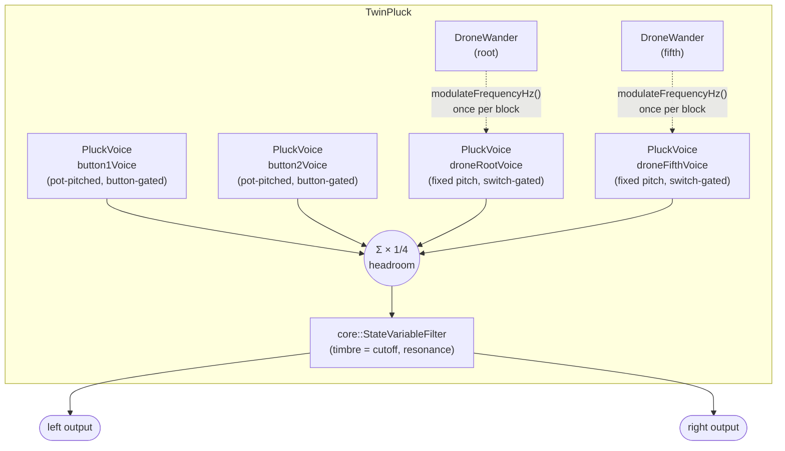
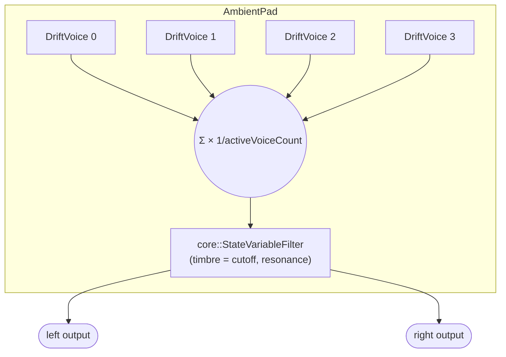
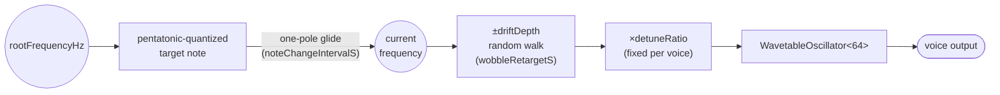
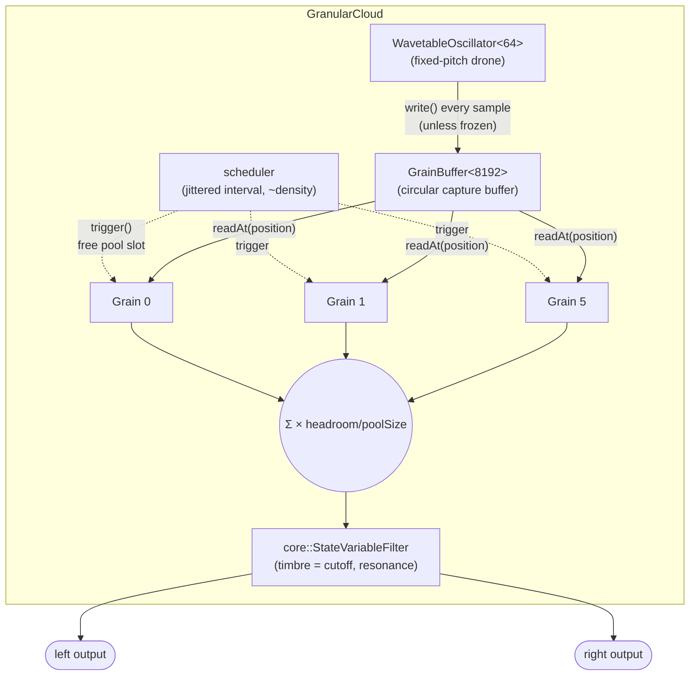
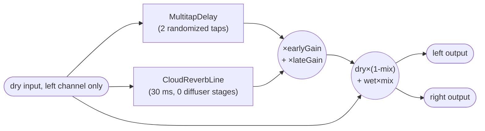
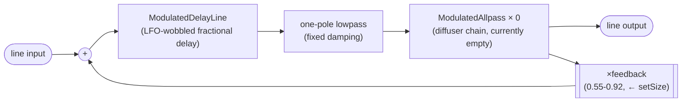

# `galerna::effects`

DSP building blocks used by the audio apps in `applications/` — see `docs/architecture.md`
for how this library fits into the overall directory layout, and `applications/README.md`
for how each app wires these classes together with pots/buttons/switches. This document
walks through four of the library's larger composites, `TwinPluck`, `AmbientPad`,
`GranularCloud`, and `CloudReverb`, block by block, since none of them is a single self-contained
class but a small tree of collaborating ones.

Both composites share the same two `galerna::core` primitives underneath:

- **`core::WavetableOscillator<TableSize>`** — a band-limited sawtooth, built once at `init()`
  as an additive sum of harmonics into a `TableSize`-sample table, then read back with linear
  interpolation. Every oscillator in this library (`PluckVoice`'s pitched voices,
  `ModulatedDelayLine`'s LFOs) is one of these, just at different table sizes and frequencies.
- **`core::StateVariableFilter`** — a 2-pole resonant lowpass (Chamberlin topology). Used as
  the shared tone-shaping stage after voices are summed.

## `TwinPluck` — gated pluck/drone instrument

Signal flow: all 4 voices are summed every sample (a silent voice just contributes 0), scaled
by a fixed headroom, and shaped by one shared resonant lowpass. The two `DroneWander`
instances run at block rate (once per `processBlock()` call, not per sample) and only ever
*retune* their voice's oscillator — they sit outside the per-sample signal path shown above.

### `PluckVoice`

One gated voice: silent until `noteOn()`, sustains at full amplitude for as long as it's
held, then rings out with an exponential decay (identical decay math to `WindChimeVoice`'s
strike envelope) once `noteOff()` is called. It never self-schedules anything — no RNG, no
internal timing — the caller decides when to gate on/off, so this class only owns pitch
quantization and the held/release envelope on top of one `WavetableOscillator<64>`.

Pitch normally comes in as a 0..1 pot value via `setPendingFrequency()`, quantized onto
`core::PentatonicScale::ratios` across a `PluckVoice::octaveRange`-octave span rooted at
`PluckVoice::rootFrequencyHz` (220 Hz), so a pot's full travel always lands on a musically
consonant note rather than an arbitrary pitch. A held note can also be retuned live: setting
a new pending frequency while the voice is ringing applies it immediately (via
`modulateFrequencyHz()`) instead of only queuing it for the next `noteOn()`.

### `core::PentatonicScale`

The shared 5-ratio pentatonic scale (`1, 9/8, 5/4, 3/2, 5/3`, root through major sixth) that
both `PluckVoice` and `WindChimeVoice` quantize onto — a single source of truth so every
generative/gated voice class in this library stays consonant with itself, and (when several
voices sound together) with each other, since none of the ratios clash by a semitone.

### `DroneWander` (private to `TwinPluck`)

The two switch-gated drone voices (`droneRootVoice`, `droneFifthVoice`) additionally get a
semi-random pitch wander so a held drone drifts organically instead of holding a perfectly
static tone: each drone has its own `core::Xorshift32`-seeded `DroneWander` state that, every
~1.5 s (jittered so the two drones don't share a rhythm), picks a new random target ratio
within ±1% of the drone's center frequency, then a one-pole filter chases that target once per
`processBlock()` call (block-rate, not per-sample — a drift this slow doesn't need audio-rate
precision, and this keeps the feature's CPU cost negligible). The result is fed straight into
the voice's oscillator via `PluckVoice::modulateFrequencyHz()`, bypassing the
pending-frequency mechanism entirely so it never affects what pitch the voice reverts to
after being idle and re-triggered.

### Summing and shaping

`processBlock()` sums all 4 voices unconditionally every sample (a silent voice just
contributes 0 — there's no "active voice count" concept, unlike `WindChimes`), scales by a
fixed `1/voiceCount` headroom, runs the sum through the shared `StateVariableFilter`
(`setTimbre()`/`setResonance()` drive its cutoff/resonance), and writes the identical result
to both output channels.

## `AmbientPad` — generative ambient drone pad

Inspired by the slowly-evolving, detuned, drifting textures of Aphex Twin's *Selected Ambient
Works II* — every voice sounds continuously (there's no gating/triggering, unlike `TwinPluck`),
each independently and slowly re-picking a new pentatonic-scale-quantized note and gliding to it,
plus a continuous small "tape wobble" pitch random-walk layered on top.

Only the first `activeVoiceCount` voices are summed each block (`setActiveVoiceCount()`, same
"active voice count" idea as `WindChimes` — there's no gate to silence an unwanted voice here,
since every `DriftVoice` always produces sound). Unison/chorus thickness comes from a fixed
per-voice detune ratio (`setDetune()`), spread evenly around 1.0 across the active voices, rather
than doubling each voice's oscillator count — half the CPU cost of a classic 2-oscillator-per-voice
unison stack, which matters on a board this CPU-constrained (see `docs/architecture.md`'s Reverb
section for just how tight the budget already is with `CloudReverb` chained after this).

### `DriftVoice`

One continuously-sounding, self-drifting `core::WavetableOscillator<64>` voice — no `noteOn()`/
`noteOff()`, no envelope. Two independent drift mechanisms are layered on top of the voice's fixed
detune ratio, both updated at block rate (once per `updateDrift()` call, not per sample — same
reasoning as `TwinPluck::DroneWander`, whose block-rate updates cost only +34 cycles on real
hardware):

- **Harmonic drift**: every `noteChangeIntervalS` seconds (jittered per-voice via its own
  `core::Xorshift32`, so voices don't lock into the same rhythm), picks a new
  `core::PentatonicScale`-quantized target frequency (same quantization shape as
  `PluckVoice::setPendingFrequency()`) and glides toward it with a one-pole filter, so the pad's
  chord slowly morphs instead of holding a static drone or snapping between notes.
- **Tape wobble**: a second, independent one-pole-smoothed random walk (own `Xorshift32`, own
  retarget timer) around the current glide target — the "analog drift" character. Same
  ratio-random-walk shape as `TwinPluck::DroneWander`, kept as its own copy here rather than
  shared: that version decorates a *gated* voice at a fixed depth/rate, this one decorates an
  *always-on* voice at pot-controlled depth/rate.
- **Freeze/reseed**: `setFrozen(true)` pauses the harmonic-drift layer only (wobble keeps running,
  so a frozen chord still breathes); `reseed()` forces an immediate note re-target instead of
  waiting for the jittered timer — a manual "next chord" trigger. Both are exposed on
  `AmbientPad`/`AmbientDriftApp` as BTN1 (freeze toggle) and BTN2 (reseed).

## `GranularCloud` — granular-synthesis texture generator

Builds a texture out of many short, enveloped fragments ("grains") of an internally-captured
signal rather than a bank of continuously-sounding oscillators (`AmbientPad`) or gated ones
(`TwinPluck`). There is no working line-in on this board (see `docs/progress.md`), so — like
every other generative app here — the "recording" being granulated is a fixed-pitch
`core::WavetableOscillator` drone, not a live signal.

### `GrainBuffer`

A plain circular audio buffer: `write()` every sample, `readAt(delaySamples)` for an externally
supplied fractional offset. Unlike `ModulatedDelayLine` (which owns its own LFO and always reads
at "now minus its own wobbling delay"), several independent `Grain`s each need to read this same
shared buffer at their own, independently-advancing offset — so the offset comes in as a
parameter instead of being computed internally. Same linear-interpolation technique as
`ModulatedDelayLine::readDelayed()`/`WavetableOscillator::interpolate()`.

### `Grain`

One pool slot: silent until `trigger(startDelaySamples, playbackRate, durationSamples)`, then
reads through a `GrainBuffer` for `durationSamples`, enveloped, then goes inactive again. No
RNG/scheduling of its own — `GranularCloud` decides when and how to trigger each slot, the same
"caller decides" split as `PluckVoice`'s `noteOn()`/`noteOff()`.

- **Pitch via delay modulation**: `playbackRate != 1.0` changes the grain's read lag relative to
  the buffer's advancing write pointer over its lifetime — the same delay-modulation-as-
  pitch-shift technique `ModulatedDelayLine`'s LFO wobble already relies on, just driven by a
  fixed rate instead of an LFO. At `playbackRate == 1.0` the lag stays constant for the grain's
  whole life.
- **Envelope**: an incrementally-computed parabola (`e(t) = 4t(1-t)` over the grain's duration,
  zero at both ends, peak 1 at the midpoint), generated via constant-second-difference forward
  differencing — 2 additions per sample, no table, no trig (Ross Bencina, ["Implementing
  Real-Time Granular
  Synthesis"](http://www.rossbencina.com/static/code/granular-synthesis/BencinaAudioAnecdotes310801.pdf)).
  Deliberately not a lookup table like this codebase's other windows/waveforms
  (`WavetableOscillator`, `ModulatedDelayLine`'s LFO): a table read here would be a *second*
  interpolated memory read per grain per sample on top of the `GrainBuffer` read itself, on
  hardware that's already CPU-bound (see the CPU-cost section below).

### Scheduling and controls

A jittered per-sample countdown (same shape as `WindChimeVoice`'s strike scheduling) triggers a
new grain into a free pool slot at a rate driven by `setDensity()`. Each new grain's start
position is scattered within a safe sub-range of `GrainBuffer`'s history — reserved wide enough
on both ends that even the largest `setPitchSpread()`-driven playback-rate deviation can't drift
a grain's position out of bounds over its full duration — scaled by `setSpray()` (0 = every grain
reads the same fixed lag, a static repeating texture; 1 = scattered across the whole safe range,
a washy cloud). `setFrozen(true)` stops writing new material into `GrainBuffer` so the pool keeps
granulating a fixed snapshot instead of the live drone — the genre-standard "freeze" control
(e.g. Mutable Instruments Clouds). `retriggerAll()` force-triggers every pool slot at once, a
manual "stutter" accent. Both are exposed on `GranularCloud`/`GranularCloudApp` as BTN1 (freeze
toggle) and BTN2 (stutter).

## `CloudReverb` — "CloudSeed-lite" algorithmic reverb

A scaled-down homage to CloudSeed/CloudReverb's algorithmic-reverb topology (multitap early
reflections, plus a late-reverb line with a modulated delay and diffuser in its feedback
loop), sized down hard from the original desktop-VST scale to fit this board's CPU/memory
budget — see `docs/architecture.md`'s Reverb section for the full sizing history. There's no
working line-in on this board, so `CloudReverb` doesn't generate its own signal: it reads
whatever the effect chained before it (`WindChimes`, `TwinPluck`, ...) already wrote into the
left channel, processes that in place, and writes the wet/dry mix to both output channels.

Early and late are parallel (both fed the dry input directly, not chained), matching
CloudSeed's own "Dry / Predelay / Early / Main" mixer taps. `CloudReverb::setMix()` is the
only control on the final blend; `CloudReverb::setSize()` drives the late line's feedback gain
(`CloudReverbLine::setFeedback()`).

### `MultitapDelay<BufferSize, TapCount>` — early reflections

A single circular buffer read back through `TapCount` fixed taps at randomized (but
seeded, so reproducible) delay offsets and decaying gains, then summed — an approximation of
a room's early echo pattern. Tap positions and gains are computed once in `init()` from a
`core::Xorshift32` PRNG and never change at runtime.

### `ModulatedDelayLine<BufferSize>` — the wobbling delay underneath everything

A circular delay buffer whose read position wobbles slowly around a base delay time via a
low-rate `WavetableOscillator<16>` LFO, read back with linear interpolation between
neighboring samples. This slow wobble is what keeps a diffuser/comb network from settling
into a static, metallic-sounding fixed delay — the core ingredient behind a "cloudy" rather
than plainly resonant reverb tail. Both `CloudReverbLine`'s own delay and every
`ModulatedAllpass` diffuser stage are built on one of these.

### `ModulatedAllpass<BufferSize>` — diffuser stage

One Schroeder allpass "diffuser" stage: a `ModulatedDelayLine` wrapped in the classic
single-multiply allpass feedback topology. Chaining a few of these in series is what
thickens a sparse set of echoes into a smooth wash. `feedback == 0` degenerates to a plain
modulated delay tap, which is how `CloudReverbLine` reuses the same modulation math for its
own (non-diffusing) delay via `ModulatedDelayLine` directly.

### `CloudReverbLine<DelayBufferSize, DiffuserBufferSize, DiffuserStageCount>` — the late tail

One late-reverb "line": a `ModulatedDelayLine` in a feedback loop, with a one-pole damping
lowpass and a chain of `DiffuserStageCount` `ModulatedAllpass` stages inside the loop
(delay → damping → diffuser chain → back into the delay). The original design used several
of these lines in parallel plus a multi-stage diffuser chain and two independent per-channel
tanks for stereo width; real hardware profiling showed that costing ~5.8x the per-block CPU
budget, so the shipped `CloudReverb` cuts down to **one shared mono line, zero diffuser
stages** (`DiffuserStageCount = 0`) — `CloudReverbLine` degrades gracefully to a plain
modulated, damped, feedback delay when diffusion is disabled this way. `setFeedback()` (driven
by `CloudReverb::setSize()`) is clamped below a fixed ceiling so the loop (delay + damping +
diffuser, all unity-gain-ish at best) always converges.

With `DiffuserStageCount > 0` (as the class supports, just not as currently instantiated by
`CloudReverb`), `diffuser` would be a real chain of `ModulatedAllpass` stages between `damp`
and `output`/`fb` instead of a pass-through.

### Putting it together

`CloudReverb::processBlock()` reads the dry left-channel sample, runs it through both the
`MultitapDelay` (early reflections) and the `CloudReverbLine` (late tail) in parallel, sums
the two with fixed gains, and cross-fades that wet signal against the original dry signal by
`setMix()`'s wet/dry ratio — written identically to both output channels.

## CPU-cost discipline

Every class above that sits on the audio-rate hot path (`PluckVoice::process()`,
`WavetableOscillator::process()`, `ModulatedDelayLine::write()`/`readDelayed()`,
`CloudReverbLine::process()`, `CloudReverb::processBlock()`, `TwinPluck::processBlock()`) is
marked `[[gnu::always_inline]]` or `[[gnu::flatten]]`. This isn't optional polish — real
hardware DWT cycle-count profiling showed this board's `-Os` build declining to inline across
these call chains by default, so cross-function call overhead (stack push/pop, argument
passing) dominated the actual FLOP cost. Any new class added to one of these hot paths should
follow the same pattern, and any change to one should be re-verified on real hardware against
the per-block cycle budget (see `TwinPluck`'s and `CloudReverb`'s own class-level doc comments
for the measurement method and this codebase's established "no razor's-edge budget fits"
precedent).
